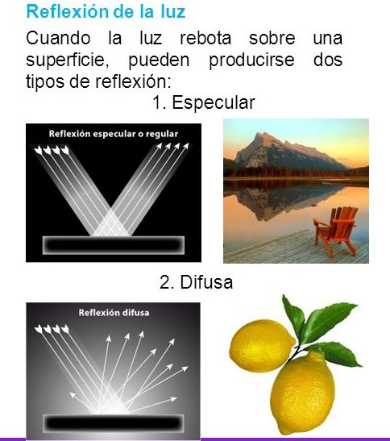

## Reflexión Especular

- Es propia de superficies brillantes, pulidas, y responsable de los
brillos que suelen observarse.
- El color del brillo suele ser diferente del color de la superficie y muy
parecido al color de la fuente de luz.
- Phong propone que la luz que llega al observador dependa
´unicamente del ´angulo Φ entre el vector de reflexi´on perfecta R y el
vector direcci´on del observador V.
- Si R y V son vectores unitarios, ks
, 0 ≤ ks ≤ 1, representa la parte
de luz especular reflejada por la superficie y α modela el brillo
caracterıstico del material de la superficie.

<a href="https://github.com/visualcomputingcoders/visualcomputingcoders/blob/master/_projects/especular/ilumina.js"> codigo </a>

 
  
    
    

